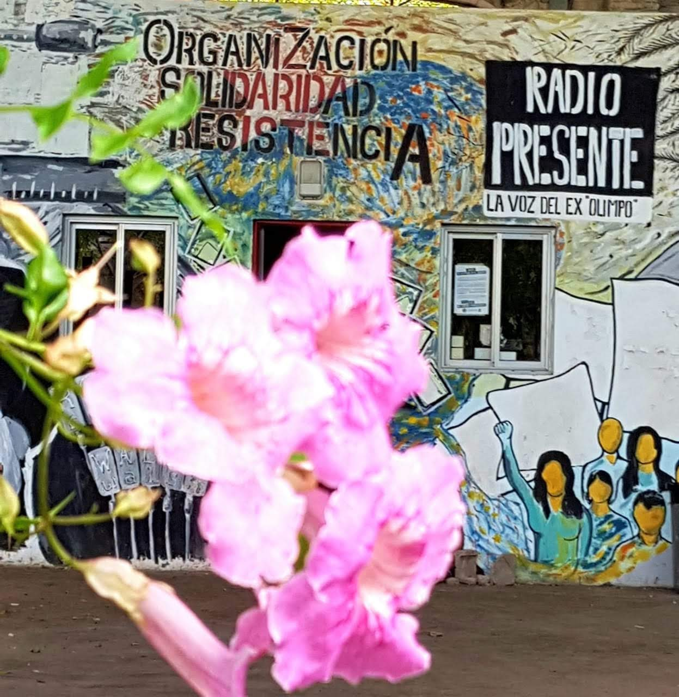

<h1 align="center"> Radio Presente </h1>
<h3 align="center"> La voz del Ex Olimpo </h3>

<h2 align="center">Hi 👋, I'm Martín Nicolás Parolari</h2>
<h3 align="center">This project is intended, totally ad honorem and for social commitment, to work on the website of a community, alternative and popular radio station in Buenos Aires, Argentina that works inside a former Clandestine Center for Detention, Torture and Extermination called Olimpo, now recovered as a site of memory. . For those who do not know about the history, the Ex CCDTyE were places used to torture, interrogate, rape, hold illegally detained and eventually murder people, and they operated during the last military dictatorship in Argentina between 1975 and 1983. For all this, the operation of a radio is symbolically important; to give voice, to give life to a space in which there was, for many years, a lot of death.</h3>

  

  

  

- 🔭 I’m currently working on **Radio Presente**

- 🌱 I’m currently learning **Applications Development**

- 👨‍💻 All of my projects are available at [https://github.com/mnparolari](https://github.com/mnparolari)

- 📫 How to reach me **mnparolari@gmail.com**

<h3 align="left">Connect with me:</h3>

<h3 align="left">Languages and Tools:</h3>

       
